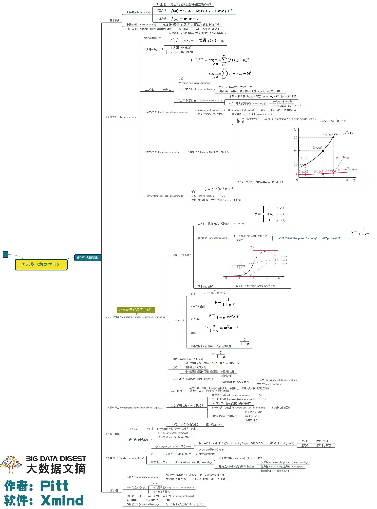

学习章节
第一章绪论

第三章线性模型
内容：
	熟悉线性回归(Linear Regression)、逻辑回归(Logistic Regression)和线性判别(LDA)求解的推导过程(梯度下降或者正则化)
	了解多分类学习的拆分策略
	了解如何处理类别不平衡问题
	习题
附加：(适合精力旺盛、时间充沛的朋友)
	Ridge回归、Lasso回归、ElasticNet回归
	Lasso的优化方法(最小角、坐标轴)
Tips：
	建议大家可以去手推一下算法推导过程，如果有时间的话，也可以考虑去实现一下。
	如果是熟悉Octave也可以去申一下吴恩达老师机器学习课程。因为吴恩达老师的机器学习是用Octave完成作业的，所以不是熟悉Octave的话看看视频就好了。

​	如果想要验证自己的算法，也建议去用sklearn里带的波士顿房价、莺尾花数据集，方便比对sklearn封装好的算法。
​	下面这个图或许对你们的整理有帮助。

