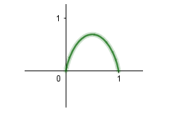

## entroy
还可以补充信息论其他关于互信息(I(x))，交叉熵等概念。

https://blog.csdn.net/sudakuang/article/details/78134691

将约束条件引入函数，偏微分求解。
$p_k = 2^λ$，$p_k$都相等，因此$p_k = 1/n$.
另外一种证明方法：先证2个概率，熵最大为中间值，再推广到n个。

http://www.math345.com/blog/article/17

## 
我补充点其实决策树的结点不仅可以包含预测类别，还可以包含置信概率，拿上面提到的图4.4分支中浅白被分类成好瓜的概率为2/3。
这样理解整个算法，预剪枝和数据冲突都会更容易。
我是运行sklearn中的决策树(基于cart)，才领会到的。