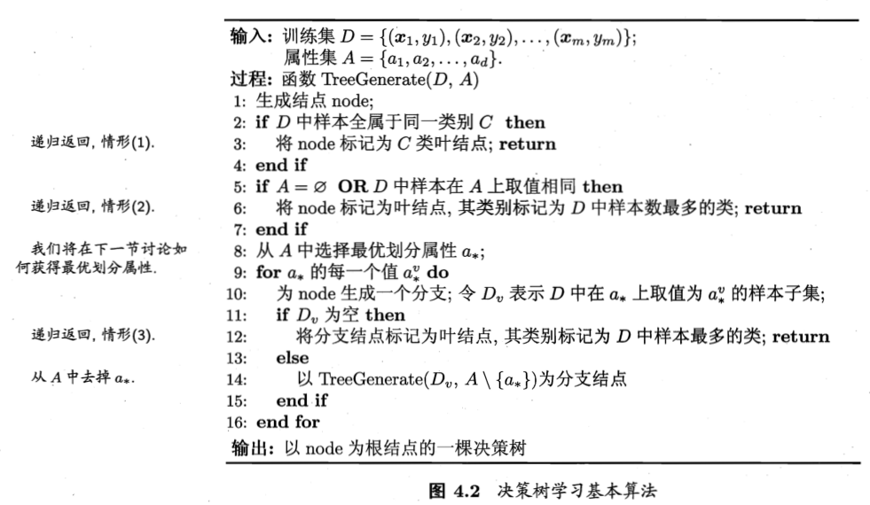

[TOC]

# 第4章 决策树

**决策树**(Decison Tree)是基于**树结构**决策的机器学习算法。

 

## 4.1 基本流程

决策树采用**分而治之**(Divide and Conquer)策略，以一系列的子决策决定**分类**结果。

一颗决策树包含一个**根结点**、若干个**子结点**和若干个**叶结点**。根结点包含**样本全集**；子结点对应**属性划分**，包含**划分样本**；叶结点对应**决策结果**，包含**决策样本**。从根结点到每个叶结点的路径对应一个**判定测试序列**（系列子决策）。

决策树的生成是一个递归过程。有三种情形导致递归返回。

- (1)当前结点包含的样本全**属于同一类别**，无需划分，该结点类别确定。

- (2)所有样本在所有**属性值相同**，或**属性集为空**，无法划分，该结点类别设定为所含样本最多的类别（利用当前结点的**后验分布**）。

- (3)当前结点包含的样本集合为空，不能划分。父结点类别确定（利用当前结点的**先验分布**）。

 

## 4.2 划分选择

$$
\text{更一般地，考虑单调可微函数}g(\cdot)，令
\\
y = g^{-1}\left(\boldsymbol{w}^{\mathrm{T}} \boldsymbol{x}+b\right)
$$

其中函数$g(\cdot)$称为**联系函数**。根据不同的$g(\cdot)$，构造不同的非线性模型。

 

### 4.2.1 信息增益

 

### 4.2.2 增益率

 

### 4.2.3 基尼指数

 

## 4.3 剪枝处理 

$$
f\left(x_{i}\right)=w x_{i}+b\text{，使得}f\left(x_{i}\right) \simeq y_{i}
$$

样本由d个属性描述，我们试图获取样本的类别$y_{i}$，这称为**多元线性回归**(Multivariate Linear Regression)。

衡量的方法为均方误差(Square Loss)，对应欧氏距离($L_2$范式)。

采用<a href="https://blog.csdn.net/the_harder_to_love/article/details/89153251">**最小二乘法**(Least Square Method)</a>，求得$\boldsymbol{w}和\boldsymbol{b}$。

 
$$
\hat{\boldsymbol{w}}^{*}=\left(\mathbf{X}^{\mathrm{T}} \mathbf{X}\right)^{-1} \mathbf{X}^{\mathrm{T}} \boldsymbol{y}
\\
f\left(\hat{\boldsymbol{x}}_{i}\right)=\hat{\boldsymbol{x}}_{i}^{\mathrm{T}}\left(\mathbf{X}^{\mathrm{T}} \mathbf{X}\right)^{-1} \mathbf{X}^{\mathrm{T}} \boldsymbol{y}
$$
由于$\mathbf{X}^{\mathrm{T}} \mathbf{X}$通常不是满秩矩阵，可解出多个的$\hat{\boldsymbol{w}}^{*}$，引入**正则化**(Regularization)项，决定**学习算法的归纳偏好**。

 

### 4.3.1 预剪枝

输出标记在指数尺度上变化

$$
y=\frac{1}{1+e^{-z}}=\frac{1}{1+e^{-\left(w^{\mathrm{T}} x+b\right)}}
\\
\ln \frac{y}{1-y}=\boldsymbol{w}^{\mathrm{T}} \boldsymbol{x}+b
$$
若将y视为样本x作为正例的可能性，则1-y是其反例的可能性，而二者比值$\frac{y}{1-y}$称为**几率**(odds)，取对数则得到**对数几率**$\ln \frac{y}{1-y}$(log odds，logit)。

将y视为后验概率估计$p(y=1 | x)$，再通过极大似然法(Maximum Likelihood Method)
$$
\ell(\boldsymbol{w}, b)=\sum_{i=1}^{m} \ln p\left(y_{i} | \boldsymbol{x}_{i} ; \boldsymbol{w}, b\right)
$$
这是个**高阶可导连续凸函数**，可以使用经典数值优化算法：**梯度下降法**(Gradient Descent Method)，**牛顿法**(Newton Method)等求其最优解。

 

### 4.3.2 后剪枝

 

## 4.4  连续与缺失值

### 4.4.1 连续值处理

 

### 4.4.2 缺失值处理

 

## 4.5 多变量决策树

 

## 4.6 阅读材料
### 4.6.1 决策树构造

 

### 4.6.2 增量学习

 

